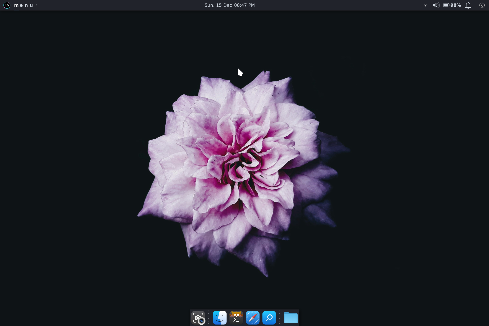
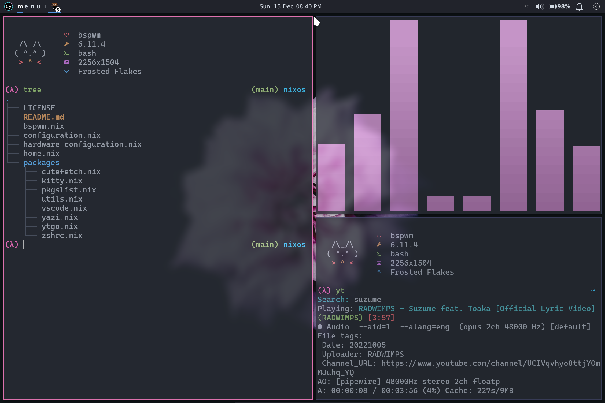
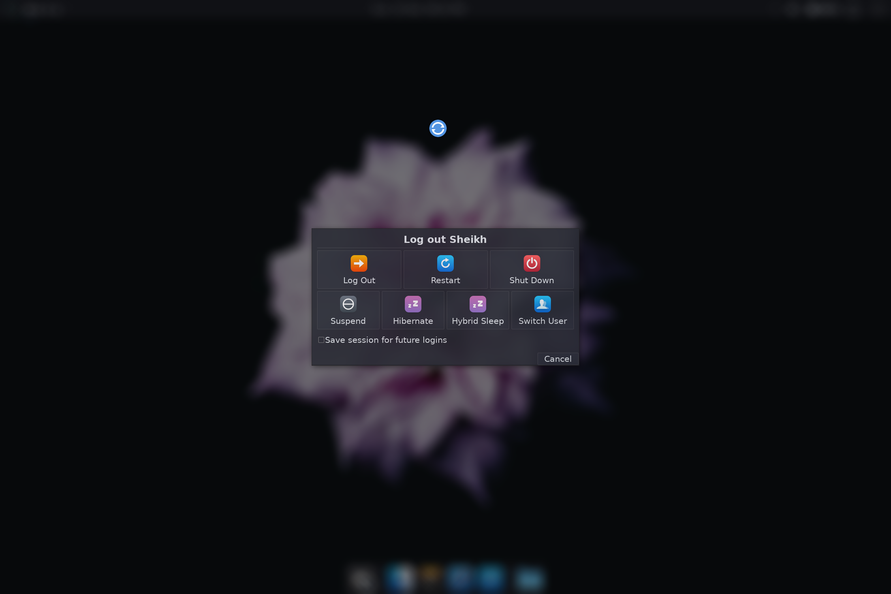

# Nix Dotfiles

## My Personal Nix Config

> [!WARNING]
> **Use at your own risk.** It works _for me_, but it may not work _for you_. At least not without adjustments.

---

### Features

- **Flake-based**
- XFCE desktop environment
- BSPWM window manager
- Brave browser
- Kitty terminal
- Zsh shell
- etc.

### Components

- [`flake.nix`](./flake.nix)

  _**Config entrypoint**_: This flake contains a darwin config and a linux config. Modify username, hostname, and Nix config directory here. There's a line in the linux config to activate on Surface devices that require just the linux-surface kernel. More on that under [NixOS](#nixos).

- [`sys/`](./sys/) (directory)

  _**System configs**_: Configure various system components, like home-manager, unfree software, system-wide packages, etc.

- [`pkg/`](./pkg/) (directory)

  _**Package configs**_: Install and configure various software for the user.

- [`cfg/`](./cfg/) (directory)

  _**Configs**_: Manage non-Nix configuration files.

---

### Installation

Edit [`flake.nix`](./flake.nix) to change username and hostname, and change config location to the local clone of this repo and export that path using `export NIXOS_CONFIG_DIR="<path/to/clone>"`. Then depending on your platform, run the following lines:

#### NixOS

> [!IMPORTANT]
> Use flake `#linux-surface` instead of `#linux` in the last command _if you’re using a Surface device_ **and** _you want the `linux-surface` kernel_.

```sh
# use autogenerated hardware config instead of cloned one
mv "$NIXOS_CONFIG_DIR/sys/hardware-configuration.nix" "$NIXOS_CONFIG_DIR/sys/hardware-configuration.nix.bak"
cp "/etc/nixos/hardware-configuration.nix" "$NIXOS_CONFIG_DIR/sys/"

# rebuild system from config
sudo -H nixos-rebuild --experimental-features "nix-command flakes" switch --flake "$NIXOS_CONFIG_DIR#linux" # or linux-surface
nix run home-manager/master -- --switch --flake "$NIXOS_CONFIG_DIR#linux" # or linux-surface
```

#### macOS

```sh
# rebuild system from config
nix --experimental-features "nix-command flakes" run nix-darwin/master#darwin-rebuild -- switch --flake "$NIXOS_CONFIG_DIR#darwin"
nix run home-manager/master -- --switch --flake "$NIXOS_CONFIG_DIR#darwin"
```

---

### Screenshots




