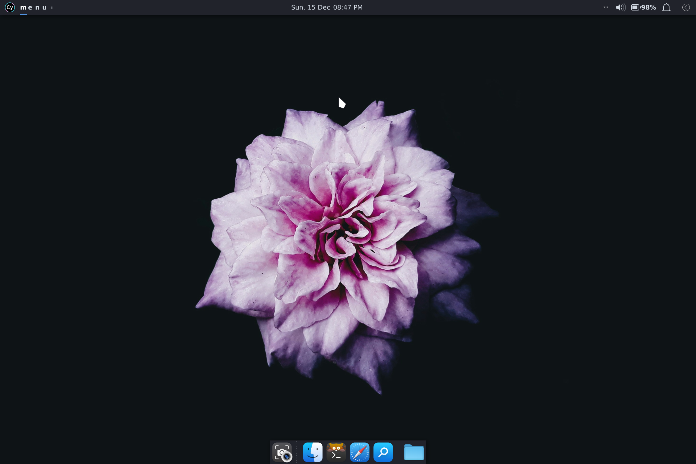
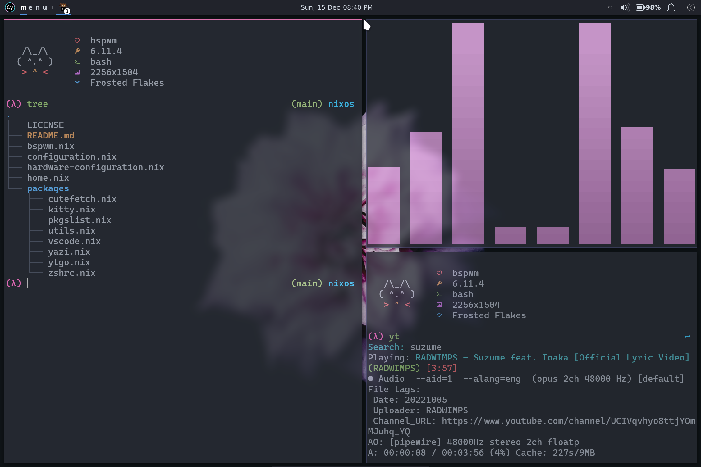
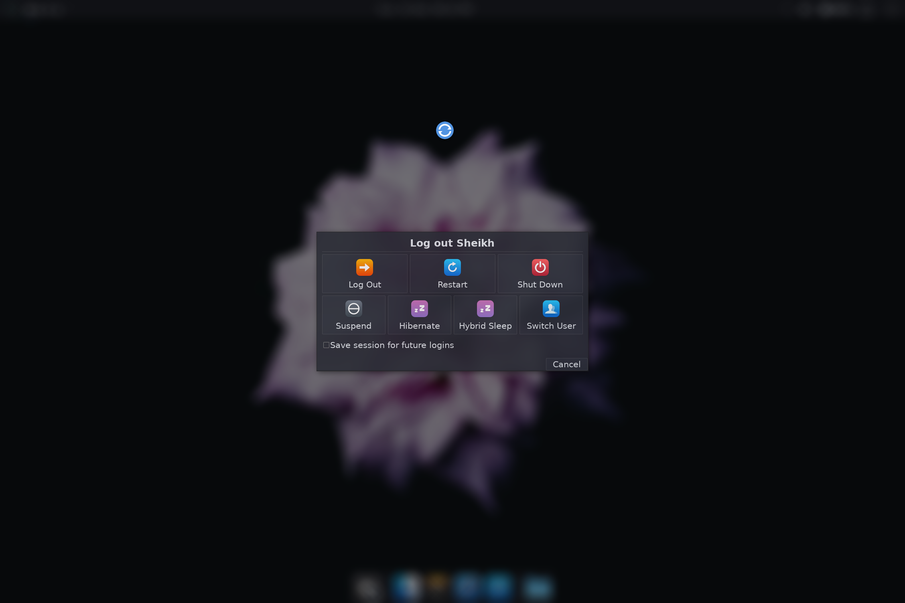

# NixOS Dotfiles

## My Personal NixOS Config

> [!CAUTION]
> **THIS DOCUMENTATION AND THE INSTALLER SCRIPT ARE OBSOLETE.** Will update soon. Meanwhile, check out the code and **PROCEED WITH CAUTION**.

> [!NOTE]
> **Use at your own risk.** It works _for me_, but it may or may not work _for you_.

---

### Modules

- [`configuration.nix`](./configuration.nix)

  _**System config**_: I don't usually modify unless I want something done system-wide rather than for my user.

- [`hardware-configuration.nix`](./hardware-configuration.nix)

  _**Hardware config**_: Created during system installation. Did not modify it since.

- [`system.nix`](./system.nix) | [`system-surface.nix`](./system-surface.nix)

  _**Device-specific config**_: Specify device hostname here. The `-surface` file is used in the installer script to build the Linux Surface kernel if desired.

- [`home.nix`](./home.nix)

  _**`home-manager` config**_: `home-manager` related config goes here. Also whatever files need to be directly sourced to somewhere in the `HOME` directory _(like a `neovim` config for which I have a separate repository)_.

- [`bspwm.nix`](./bspwm.nix)

  _**BSPWM config**_: Window manager, startup programs, keybinds, themes, etc. configured here.

- [`packages/`](./packages/) (directory)

  _**Installed software config**_: Install and configure various software for the user.

<details>

<summary><b><code>packages</code> submodules</b> <i>(click to expand)</i></summary>

- [`packages/pkgslist.nix`](./packages/pkgslist.nix)

  _**List of packages to install**_: Software to install that need no further configuration.

- [`packages/utils.nix`](./packages/utils.nix)

  _**Utility packages**_: Small utility programs that need _some_ configuration _(like Git, cava, etc.)_.

- [`packages/zshrc.nix`](./packages/zshrc.nix)

  _**Z-shell config**_: Declarative equivalent of a `.zshrc` file, in the Nix language.

- [`packages/kitty.nix`](./packages/kitty.nix)

  _**Kitty terminal config**_: Configure the Kitty terminal emulator in Nix.

- [`packages/vscode.nix`](./packages/vscode.nix)

  _**Visual Studio Code config**_: Configure VS Code text editor in Nix.

- [`packages/yazi.nix`](./packages/yazi.nix)

  _**Yazi (TUI file manager) config**_: Configure the yazi file manager in Nix.

- [`packages/ptpython.nix`](./packages/ptpython.nix)

  _**`ptpython` package**_: Custom Nix package for `ptpython` - a Python interpreter with various convenience features like inline documentation, syntax highlighting, modal editing, etc. Source: [prompt-toolkit/ptpython](https://github.com/prompt-toolkit/ptpython)

- [`packages/cutefetch.nix`](./packages/cutefetch.nix)

  _**`cutefetch` package**_: Custom Nix package for my `cutefetch` program - a minimalistic sysinfo fetch script featuring cute animals. Source: [cybardev/cutefetch](https://github.com/cybardev/cutefetch)

- [`packages/ytgo.nix`](./packages/ytgo.nix)

  _**`ytgo` package**_: Custom Nix package for my `ytgo` program - a terminal media player which I mainly use for background music while coding. Source: [cybardev/ytgo](https://github.com/cybardev/ytgo)

</details>

---

### Installation

> [!NOTE]
> Run `export SURFACE_KERNEL=1` _before_ running the following script **if you’re using a Surface device**.

Run the [install.sh](./install.sh) script:

```sh
curl -sS "https://raw.githubusercontent.com/cybardev/nixos-dotfiles/refs/heads/main/install.sh" | bash -e
```

<details>

<summary><b>Individual installation steps</b> <i>(click to expand)</i></summary>

1. Clone into `~/.config`

    ```sh
    git clone "https://github.com/cybardev/nixos-dotfiles.git" ~/.config/nixos
    ```

2. Make backup of current config

    ```sh
    sudo mv /etc/nixos /etc/nixos.bak
    ```

3. Soft-link to NixOS config directory

    ```sh
    sudo ln -s $HOME/.config/nixos /etc/nixos
    ```

4. Replace `hardware-configuration.nix` with one appropriate for your system

    ```sh
    mv ~/.config/nixos/hardware-configuration.nix ~/.config/nixos/hardware-configuration.nix.bak
    cp /etc/nixos.bak/hardware-configuration.nix ~/.config/nixos/
    ```

5. Add the `home-manager` channel

    ```sh
    sudo nix-channel --add "https://github.com/nix-community/home-manager/archive/release-24.11.tar.gz" home-manager
    ```

6. **[OPTIONAL]** Enable `linux-surface` kernel _(if you have a Surface device)_
    - _Add the `nixos-hardware` channel_:

      ```sh
      sudo nix-channel --add "https://github.com/NixOS/nixos-hardware/archive/b12e314726a4226298fe82776b4baeaa7bcf3dcd.tar.gz" nixos-hardware
      ```

    - _Use Surface-specific configuration file_:

      > Change the `system.nix` import to `system-surface.nix` in [`configuration.nix`](./configuration.nix)

7. Update added channel(s)

    ```sh
    sudo nix-channel --update
    ```

8. Rebuild system from new config

    ```sh
    sudo nixos-rebuild switch
    ```

</details>

---

### Screenshots




